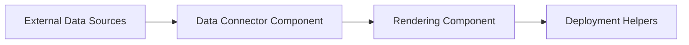
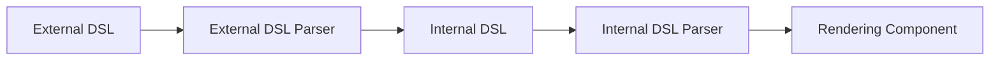
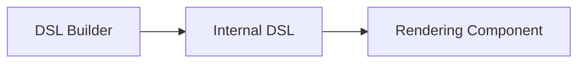
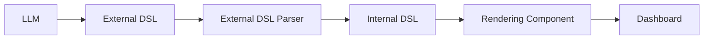

# Architecture Overview

Primary project entry point: [README.md](../README.md)

## Purpose

This project is best understood as a three-part architecture:

1. Rendering Component
2. Deployment Helpers
3. Data Connector Component

This structure keeps the platform focused on display, deployment support, and external data access while remaining lightweight and modular.

## Executive Summary

The system is organized into three main concerns:

1. Rendering Component
2. Deployment Helpers
3. Data Connector Component

These components work together to bring external data into a visual dashboard experience and to support multiple runtime deployment models.

## High-Level Architecture



## Component Map

### 1. Rendering Component

This is the main user-facing part of the system. It covers the logic for building and displaying dashboard content, including the DSL, internal representations, and UI views.

The rendering component is responsible for:

- defining dashboard structure and behavior
- translating external definitions into internal runtime objects
- rendering charts, tables, and input widgets
- presenting a coherent viewer experience to users

This component includes the project’s DSL concepts and UI-related primitives, even though the architecture is simplified into a single rendering responsibility.





Key ideas in this component:

- DSL Builder: assembles configuration or model definitions.
- External DSL: user-facing or declarative layer for describing behavior and structure.
- Internal DSL: normalized representation used by the application runtime.
- Internal DSL Parser: converts internal definitions into executable structures.
- External DSL Parser: converts external definitions into the internal form.

UI elements inside the rendering layer:

- Charts
- Tables
- Input components

### 2. Deployment Helpers

This component handles packaging and runtime deployment support. It is not the core logic, but it enables the application to run in different environments and distributions.

Deployment helper capabilities include:

- centralized server deployment
- standalone installation support
- Uberjar packaging
- jlink + jpackage packaging
- GraalVM/native optimization support
- Be Placed inside another Clojure application 

This component acts as the operational wrapper around the rendering system.

### 3. Data Connector Component

This is the integration boundary for external data sources. It fetches, adapts, and normalizes the data so that the rendering layer can consume it consistently.

Responsibilities include:

- connecting to external data sources
- retrieving data
- normalizing input for downstream consumption
- allowing the rendering component to remain decoupled from raw source details

## Architectural Relationships

### Dependency direction

- External data sources feed into the Data Connector Component.
- The Data Connector Component provides data to the Rendering Component.
- The Rendering Component produces the user-visible dashboard experience.
- Deployment Helpers wrap or enable the runtime execution of the system.

### Design intent

The architecture is intentionally organized around three responsibilities:

- render the dashboard and UI experience,
- support deployment and packaging options,
- and integrate external data sources.

This keeps the system simple and modular while still covering the essential building blocks described in the project README.

## LLM-Friendliness

### Core idea

This project is designed so an LLM can generate an External DSL definition for a dashboard, and that definition is then converted into a rendered dashboard experience.

The intended flow is:



This is the key LLM-friendly behavior: the model produces a DSL that describes the dashboard, and the system turns that description into the final UI.

### Domain summary

Project type: AI-friendly dashboard/data visualization platform

Core components:
- Rendering Component
- Deployment Helpers
- Data Connector Component

Primary responsibilities:
- accept declarative dashboard intent from an LLM or human author
- parse External DSL into a usable runtime structure
- render charts, tables, and input widgets
- connect to external data sources and normalize input
- package and run the application in different deployment modes

### Expected runtime flow

1. An LLM writes External DSL describing the dashboard.
2. The External DSL Parser converts that DSL into an internal representation.
3. The Rendering Component interprets the parsed definition and builds the dashboard UI.
4. External data is loaded through the Data Connector Component and bound into the view.
5. Deployment Helpers support how the system is packaged and launched.

### Machine-readable facts

```yaml
project:
  name: dashje
  type: llm_friendly_dashboard_platform
  architecture_style: three_component_modular
  llm_workflow:
    - llm_generates_external_dsl
    - external_dsl_parser_translates_definition
    - rendering_component_builds_dashboard
  components:
    - rendering_component
    - deployment_helpers
    - data_connector_component
  deployment_modes:
    - centralized_server
    - standalone_installation
    - another_clojure_application
  packaging_options:
    - uberjar
    - jlink_plus_jpackage
    - graalvm
```

## Final Note

This simplified architecture matches the project’s intended structure: one component for rendering, one for deployment support, and one for external data integration. It preserves the README concepts while making the design easier to reason about and communicate.
